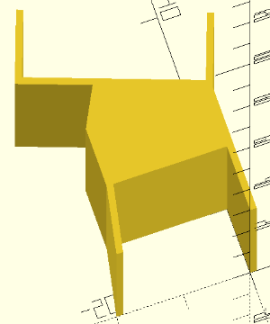

# OpenSCAD_items

My OpenSCAD items.

## headphone hook
- 16mmの角柱にひっかけるためのヘッドフォンフック
- Rev.1はそのまま作っただけ
- Rev.2は底面が曲がるのを防ぐために微妙に屋根状にした
- 

## LEDstand on LCD
- I/Oデータの[EX-LDQ271DB](https://www.iodata.jp/product/lcd/wide/ex-ldq271db/)の上に[LT-NLD65L-HS](http://www.ohm-direct.com/shopdetail/006020000005/)を乗せるためのアダプタ
- カメラを付けられるように少し浮かせる必要があった
- 
- 

## LEDstand on LCD 20deg
- 上記の物の、LED照明を手前に20°傾けたもの
- 

## cheero Power Plus 3 base
- [cheero Power Plus 3 13400mAh](https://cheero.net/powerplus3/)、[cheero Power Plus 3 10050mAh](https://cheero.net/powerplus3_10050/)を立たせるための土台
- 
- 

## M5Paper Stand
- [M5Paper](http://ssci.to/6749)のスタンド
- 幅50mm、奥行き30mm、高さ10mm
- 
- 

## License
All items are MIT License.
