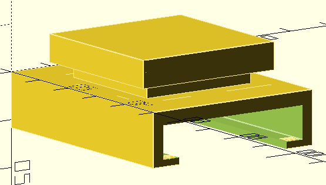
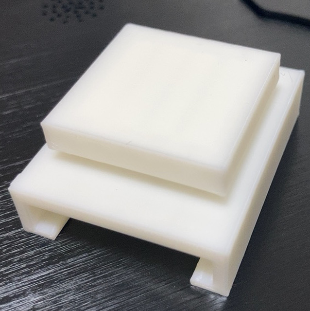

# OpenSCAD_items

My OpenSCAD items.

## [cap 5hole](cap_5hole)
- ペットボトルのふたに穴を開けたのを避難リュックに入れとくといざという時に便利だというのを見たので穴位置のガイドとして作った
- 

## [bit holder](bit_holder)
- [サンフラッグ 99-B ウルトラミニ](https://www.yodobashi.com/product/100000001001997056/)用のホルダー。裏にドライバービットが収納できる(が、微妙な寸法なのでスカスカだったりするので要調整)
-  

## [headphone hook](headphone_hook/)
- 16mmの角柱にひっかけるためのヘッドフォンフック
- Rev.1はそのまま作っただけ
- Rev.2は底面が曲がるのを防ぐために微妙に屋根状にした
- 

## [LEDstand on LCD](LEDstand_onLCD/)
- I/Oデータの[EX-LDQ271DB](https://www.iodata.jp/product/lcd/wide/ex-ldq271db/)の上に[LT-NLD65L-HS](http://www.ohm-direct.com/shopdetail/006020000005/)を乗せるためのアダプタ
- カメラを付けられるように少し浮かせる必要があった
- 
- 

## [LEDstand on LCD 20deg](LEDstand_onLCD/)
- 上記の物の、LED照明を手前に20°傾けたもの
- 

## [cheero Power Plus 3 base](heero_PowerPlus3_base/)
- [cheero Power Plus 3 13400mAh](https://cheero.net/powerplus3/)、[cheero Power Plus 3 10050mAh](https://cheero.net/powerplus3_10050/)を立たせるための土台
- 
- 

## [M5Paper Stand](m5paper_stand/)
- [M5Paper](http://ssci.to/6749)のスタンド
- 幅50mm、奥行き30mm、高さ10mm
- 
- 

## [Display arm head adaptor for greenhouse](greenhouse_arm_head/)
- [Greenhouse GH-AMCNU01](https://www.green-house.co.jp/products/gh-amcnu01/)のヘッド部分は回転しないので、90度に回せるようにするためのアダプタ。
- 下向きにすると落ちるので使う時は注意してください
- 
- 
- 
- 

## [Cable holder for Φ19mm metal rack](metal_rack_cable_clip)
直径19mmのパイプを使ったメタルラックに付けられるケーブルホルダ。
- 

## License
All items are MIT License.
